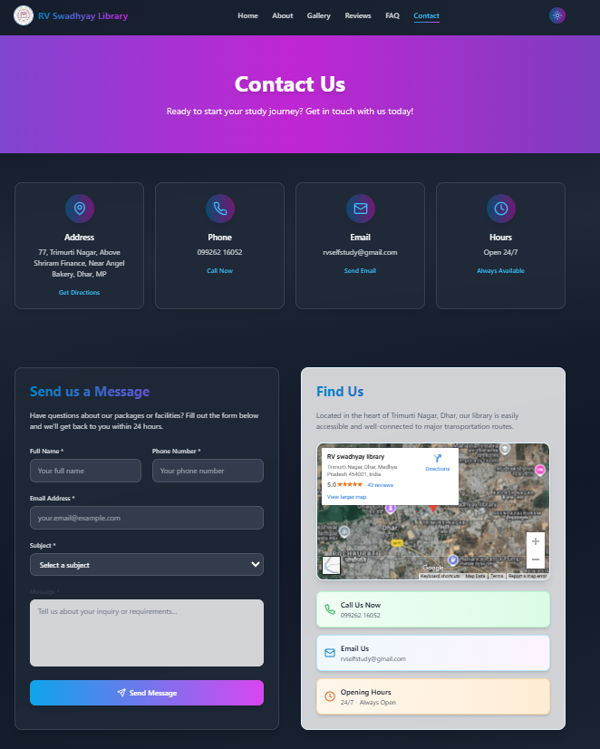

# RV स्वाध्याय लाइब्रेरी - 24/7 Self Study Library

A modern, responsive website for RV स्वाध्याय लाइब्रेरी - a professional 24/7 self-study library located in Dhar, Madhya Pradesh. This website showcases the library's facilities, services, and provides information for students preparing for competitive exams like UPSC.

---

## 🖼️ Website Previews

### 🏠 Home Page  


### 🖼️ Gallery Page  


### 📞 Contact Us Page  


---

## 🌟 Features

### Core Features
- **24/7 Availability** - Study anytime, day or night
- **High-Speed Wi-Fi** - Fast internet for research and online learning
- **Peaceful Environment** - Zero noise, complete focus atmosphere
- **Hygienic Space** - Clean and sanitized daily
- **Study Resources** - Reference books and materials available
- **Comfortable Seating** - Long-duration study chairs for maximum comfort

### Website Features
- **Modern UI/UX** - Beautiful, responsive design with gradient backgrounds
- **3D Background** - Interactive Three.js background for enhanced visual appeal
- **Multi-page Navigation** - Home, About, Gallery, Reviews, FAQ, and Contact pages
- **Mobile Responsive** - Optimized for all device sizes
- **Dark/Light Theme Support** - Context-based theme switching
- **Smooth Animations** - Engaging hover effects and transitions

## 🛠️ Tech Stack

### Frontend
- **React 18** - Modern React with hooks and functional components
- **TypeScript** - Type-safe development
- **Vite** - Fast build tool and development server
- **Tailwind CSS** - Utility-first CSS framework
- **React Router DOM** - Client-side routing

### 3D Graphics & Animations
- **Three.js** - 3D graphics library
- **React Three Fiber** - React renderer for Three.js
- **React Three Drei** - Useful helpers for React Three Fiber
- **Maath** - Mathematical utilities for animations

### Icons & UI
- **Lucide React** - Beautiful, customizable icons
- **Custom Gradients** - Brand-specific color schemes

### Development Tools
- **ESLint** - Code linting and formatting
- **PostCSS** - CSS processing
- **Autoprefixer** - CSS vendor prefixing

## 📁 Project Structure

```
project/
├── src/
│   ├── components/          # Reusable UI components
│   │   ├── Header.tsx      # Navigation header
│   │   ├── Footer.tsx      # Site footer
│   │   └── ThreeBackground.tsx  # 3D background component
│   ├── pages/              # Page components
│   │   ├── Home.tsx        # Landing page
│   │   ├── About.tsx       # About us page
│   │   ├── Gallery.tsx     # Photo gallery
│   │   ├── Reviews.tsx     # Customer reviews
│   │   ├── FAQ.tsx         # Frequently asked questions
│   │   └── Contact.tsx     # Contact information
│   ├── context/            # React context
│   │   └── ThemeContext.tsx # Theme management
│   ├── images/             # Static images
│   ├── types/              # TypeScript type definitions
│   ├── App.tsx             # Main app component
│   ├── main.tsx            # App entry point
│   └── index.css           # Global styles
├── public/                 # Static assets
├── package.json            # Dependencies and scripts
├── vite.config.ts          # Vite configuration
├── tailwind.config.js      # Tailwind CSS configuration
└── tsconfig.json           # TypeScript configuration
```

## 🚀 Getting Started

### Prerequisites
- Node.js (version 16 or higher)
- npm or yarn package manager

### Installation

1. **Clone the repository**
   ```bash
   git clone <repository-url>
   cd project
   ```

2. **Install dependencies**
   ```bash
   npm install
   # or
   yarn install
   ```

3. **Start development server**
   ```bash
   npm run dev
   # or
   yarn dev
   ```

4. **Open your browser**
   Navigate to `http://localhost:5173` to view the website

### Available Scripts

- `npm run dev` - Start development server
- `npm run build` - Build for production
- `npm run preview` - Preview production build
- `npm run lint` - Run ESLint for code quality

## 🎨 Customization

### Colors and Branding
The project uses a custom color scheme defined in `tailwind.config.js`. You can modify the primary and secondary colors to match your brand:

```javascript
// tailwind.config.js
theme: {
  extend: {
    colors: {
      primary: {
        50: '#f0f9ff',
        100: '#e0f2fe',
        // ... other shades
        600: '#0284c7',
      },
      secondary: {
        50: '#fdf4ff',
        100: '#fae8ff',
        // ... other shades
        600: '#c026d3',
      }
    }
  }
}
```

### Content Updates
- **Images**: Replace images in `src/images/` directory
- **Text Content**: Update content in respective page components
- **Contact Information**: Modify contact details in `Contact.tsx`

## 📱 Responsive Design

The website is fully responsive and optimized for:
- Desktop (1024px and above)
- Tablet (768px - 1023px)
- Mobile (320px - 767px)

## 🌐 Deployment

### Build for Production
```bash
npm run build
```

### Deploy Options
- **Vercel**: Connect your GitHub repository for automatic deployments
- **Netlify**: Drag and drop the `dist` folder
- **GitHub Pages**: Use GitHub Actions for automated deployment
- **Traditional Hosting**: Upload the `dist` folder to your web server

## 🤝 Contributing

1. Fork the repository
2. Create a feature branch (`git checkout -b feature/amazing-feature`)
3. Commit your changes (`git commit -m 'Add some amazing feature'`)
4. Push to the branch (`git push origin feature/amazing-feature`)
5. Open a Pull Request

## 📄 License

This project is licensed under the MIT License - see the [LICENSE](LICENSE) file for details.

## 📞 Contact

**RV स्वाध्याय लाइब्रेरी**
- Location: Dhar, Madhya Pradesh, India
- Services: 24/7 Self-study library with Wi-Fi
- Specialization: UPSC and competitive exam preparation

For website-related inquiries, please contact the development team.

---

**Built with ❤️ for RV स्वाध्याय लाइब्रेरी** 
